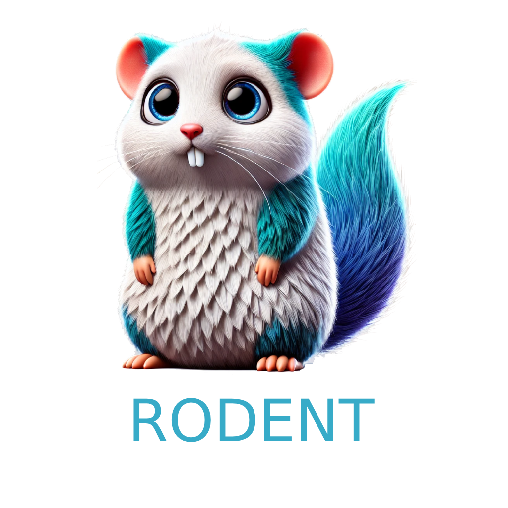

<p align="center">
    <picture>
      
    </picture>
</p>

# Overview

Rodent is a cloud native, high-availability screenshotting service.

# Glossary

- `mischief`: in reference to the fact that a "group of rats" is called a "mischief of rats"

# Features

- [x] Screenshot a URL
- [ ] Screenshot a URL with a custom viewport
- [x] Take care of "zombie" processes from the browser

# CLI - Quickstart

Install the CLI:

```bash
go install github.com/yyewolf/rodent@latest
```

Take a screenshot:

```bash
rodent screenshot https://example.com -o example.png
```

Start the Rodent API Server

```bash
rodent api
```

# API - Configuration
